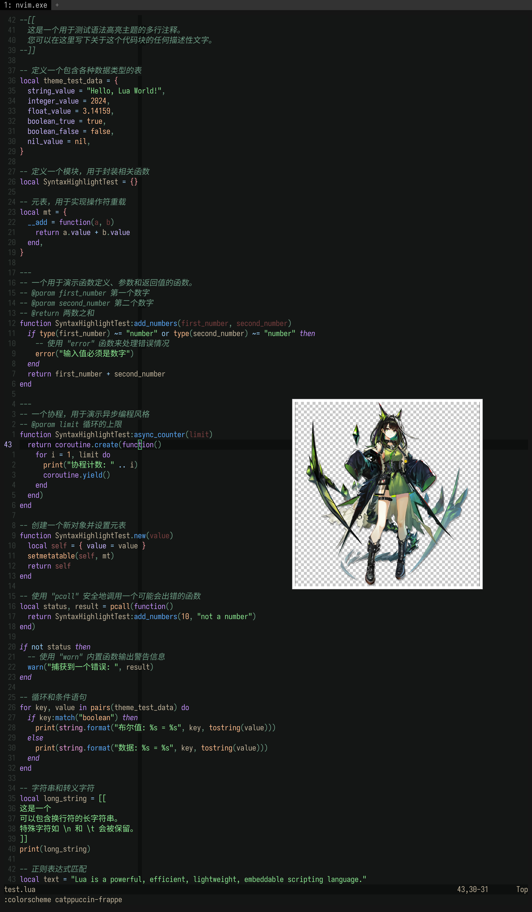

# mon3tr

## 简介

Mon3tr 是游戏《明日方舟》及其衍生作品的登场角色。它最初以一个陪伴凯尔希的怪异实体形象登场。

她的名字是 Mon3tr。
她的名字读作 “Monster”。

## 配色

| 分类 | 名称      | Hex 代码  | 设计思路                                               |
| ---- | --------- | --------- | ------------------------------------------------------ |
| 基础 | Base      | #141615 | 取自她袖子的近黑墨绿，作为总体背景基调，降低亮度以护眼 |
| 基础 | Mantle    | #0D0F0E | Base 再压暗 20%，用作次级面板或浮层底色                |
| 基础 | Crust     | #010101 | 图像中最深的黑，用于极暗区域与终端黑                   |
| 基础 | Surface 0 | #252927 | Base +7 L，轻微提绿；用于普通面板，亮度比旧色 (#1C1F1D) 更接近 Catppuccin 阶梯。 |
| 基础 | Surface 1 | #353D39 | Base +14 L；比 Surface 0 再亮一级，饱和度 +2 pp，使卡片边界更分明。 |
| 基础 | Surface 2 | #45504B | Base +21 L；用于代码块高亮底色，取代旧色 (#272D2A) 以获得更显著层次。 |
| 基础 | Overlay 0 | #55695F | Base +29 L；适合作分隔线/注释，亮度与旧 (#3F4940) 拉开到一个清晰层级。 |
| 基础 | Overlay 1 | #5E7F6E | Base +35 L；比 Overlay 0 更醒目，用于悬浮窗或活动标签底色。 |
| 基础 | Overlay 2 | #6B9A83 | Base +43 L；最高亮 Overlay，供状态条／聚焦元素。 |
| 基础 | Text      | #C4B69D | 采自她偏冷白肤色，调高亮度保证可读性                   |
| 基础 | Subtext 1 | #AEA390 | Text 亮度 –7 pp、饱和度 ×0.63；用于弱强调文字。 |
| 基础 | Subtext 0 | #989081 | Text 亮度 –14 pp、饱和度 ×0.41；用于辅助说明文字。 |
| 语义 | Green     | #8CEA92 | 直接提取晶体的荧光绿，Mon3tr 的标志色                  |
| 语义 | Teal      | #6EE1CA | 将 Green 色相向青移动 15° 获得的清浅青                 |
| 语义 | Red       | #9C5B5B | 来自立绘中细节红线，适合警告色                         |
| 语义 | Maroon    | #7A3F3F | Red 降亮降饱和 20% 的深栗色                            |
| 语义 | Sky       | #9CD4FF | Blue 提高亮度并加青，作通知色                          |
| 语义 | Sapphire  | #3578E5 | Blue 深化并略增紫感，呈宝石蓝                          |
| 语义 | Blue      | #5AA9F9 | 取自能量刃的冷光蓝，保持高饱和                         |
| 语义 | Lavender  | #C8B6FF | Blue 向紫移动 30° 得到的柔和浅紫                       |
| 语义 | Rosewater | #F2D6D8 | Text 提高红调与亮度，呈淡玫瑰粉                        |
| 语义 | Flamingo  | #F5989D | Red 提高亮度 40%，用于温和提醒                         |
| 语义 | Pink      | #F5A2E5 | Rosewater 增紫得活泼粉                                 |
| 语义 | Mauve     | #C592FF | Lavender 加深饱和，形成亮紫强调                        |
| 语义 | Peach     | #FFBC8C | Pink 降紫增黄，得到柔和橙                              |
| 语义 | Yellow    | #E1DD8A | 以 Green 调黄并提亮，用作提示色                        |

## 移植

### Neovim

<!-- <details>
  <summary>修改 tokyonight.nvim</summary>

```Lua
{
	"folke/tokyonight.nvim",
	lazy = false,
	priority = 1000,
	opts = function()
		local styles = require("tokyonight.colors").styles
		styles.nozomi = vim.tbl_extend("force", styles.night, {
		_	bg = "#131914",
			bg_dark = "#010101",
			bg_dark1 = "#0d0f0e",
			bg_highlight = "#272d2a",

			-- Blues
			blue = "#5aa9f9",
			blue0 = "#0875e4",
			blue1 = "#288ff7",
			blue2 = "#6ab1f9",
			blue5 = "#9bcbfb",
			blue6 = "#cce4fd",
			blue7 = "#065cb3",

			-- Text & neutrals
			comment = "#3f4940",
			fg = "#c4b69d",
			fg_dark = "#718158",
			fg_gutter = "#3f4940",

			-- Greens
			green = "#8cea92",
			green1 = "#cbf5cd",
			green2 = "#4cde56",

			-- Reds
			red = "#9c5b5b",
			red1 = "#b07878",

			-- Other semantics
			yellow = "#e1dd8a",
			orange = "#ffbc8c",
			purple = "#c592ff",
			magenta = "#f5a2e5",
			magenta2 = "#8e1d28",
			cyan = "#6ee1ca",
			teal = "#6ee1ca",

			-- Dark accents
			dark3 = "#3f4940",
			dark5 = "#3f4940",
			terminal_black = "#8a8170",

			-- Git
			git = {
			add = "#8cea92",
			change = "#5aa9f9",
			delete = "#9c5b5b",
			},
		})_

		return {
			style = "nozomi",
			transparent = false,
			styles = {
				sidebars = "transparent",
				floats = "transparent",
			},
		}
	end,
},
```

</details> -->

<details>
  <summary>修改 catppuccin</summary>

```lua
					frappe = {
						-- mon3tr

						crust = "#010101",
						mantle = "#0D0F0E",
						base = "#141615",
						surface0 = "#252927",
						surface1 = "#353D39",
						surface2 = "#45504B",
						overlay0 = "#55695F",
						overlay1 = "#5E7F6E",
						overlay2 = "#6B9A83",
						text = "#C4B69D",
						subtext0 = "#AEA390",
						subtext1 = "#989081",

						rosewater = "#F2D6D8",
						flamingo = "#F5989D",
						pink = "#F5A2E5",
						mauve = "#C592FF",
						red = "#9C5B5B",
						maroon = "#7A3F3F",
						peach = "#FFBC8C",
						yellow = "#E1DD8A",
						green = "#8CEA92",
						teal = "#6EE1CA",
						sky = "#9CD4FF",
						sapphire = "#3578E5",
						blue = "#5AA9F9",
						lavender = "#C8B6FF",
					},
```



</details>

## 生成

要生成，需要和此角色的立绘（精英零）一起发送至 ChatGPT-o3 中。

此调色板作成时还未引入梯度概念，故需要进行 CoT。

<details>
  <summary>查看 prompt</summary>
  
```md
你是一个专业UI设计师，尤其擅长为开发者工具创造富有情感联系和视觉一致性的主题。

我希望你根据一个动漫角色的核心色系，为我创作一个专门用于代码编辑器的“暗黑模式” (Dark Mode) 调色板。这个调色板必须严格遵循下方指定的命名结构。

### 1. 角色与风格分析

- 角色名: Mon3tr
- 出处: Arknights
- 核心性格与气质: Mon3tr，她不再坚固、不再锐利、不再暴戾，不再是某些极端特性的载体，这都在提醒我们，刚刚经历的离别如此真实。Mon3tr 的各种体征极不稳定，这并不是说她的这具新身体出现了病变，而是说明她处于一种加速催化与形塑的常态中——换个浅显易懂的说法，她的这具新身体还没有真正完成。由于配色和黑绿色魔爪能量饮料的包装相似，且两者英文名字同为 Monster，因此受到了一些调侃玩梗。
- 期望的调色板感觉: 观察到这个角色整体偏绿，但是服装有黑有绿，故可以考虑以她衣服上近黑的特点为 base 或者 bg，然后再考虑绿色来作为语义色。
- 我还发送了她的立绘，名为 mon3tr.png。

### 2. 核心颜色基准

- 主要基调色 (用于背景): 观察到她的袖子（而不是袖口）是近绿的黑色，以此为 base 可行。分析并提取她的袖子的颜色。需要注意的是背景颜色应该是一种非常靠近黑色的颜色，以便于长时间观看屏幕。
- 核心文本色 (用于文字): 观察到她拥有人类的肤色，但是并不是人类，她显然更白。分析并提取她的肤色来作为文本色。
- 第一强调色 (最标志性的颜色): 她和明亮的绿色晶体有关。分析并提取这种晶体的亮绿色。
- 第二强调色 (次要特色): mon3tr.png 有不显眼的红色，找到并提取这种红色。

## 3. 设计任务与色彩学要求

请根据上述**核心颜色基准**，填充以下的调色板结构。

- 推断原则：你需要基于核心颜色，运用专业的色彩学知识（如调整饱和度、亮度，寻找邻近色、互补色）来生成剩余的颜色。所有颜色组合在一起时，必须感觉它们源自同一个角色。
- 风格指令：
  - 基础色 (Base, Mantle, Crust, Surface 0, Surface 1, Surface 2, Overlay 0, Overlay 1, Overlay 2): 以**主要基调色 (base)**为基础进行微调，确保长时间阅读的舒适性。对于 Surface 和 Overlay，数字越大则越亮。
  - 文本色 (Text, Subtext 0, Subtext 1): 以**核心文本色 (text)**为基础创建不同亮度的版本，确保清晰易读。对于 Subtext，数字越大则越亮。
  - 语义色: 必须体现用户描述的**核心性格与气质**。它们需要比基础色更鲜明，但又不能过于刺眼。
    - `Green`, `Teal` 应该从第一强调色的来源提取出来。
    - `Red`、`Maroon` 应该从第二强调色的来源提取出来。
    - `Sky`、`Sapphire`、`Blue`、`Lavender`、`Rosewater`、`Flamingo`、`Pink`、`Mauve`、`Peach`、`Yellow` 应该使用色彩学知识来生成。

## 4. 输出格式

请以 Markdown 表格的形式返回最终的调色板，包含以下列：

- 分类 (Category): 语义 (Semantic) 或 基础 (Base)
- 名称 (Name): 如 Rosewater, Base 等
- Hex 代码: 如 `#ffffff` 等
- 设计思路 (Rationale): 简要说明这个颜色的灵感来源或推导逻辑（例如：“源自金色纽扣颜色，增加了亮度以体现活泼感”）。

### 输出-移植

然后，请你继续，将我们刚刚创建的这个调色板“移植”到一个 Neovim 主题的 Lua 模板中。

这是我需要你填充的目标模板：

---@class Palette
local ret = {
bg = "#",
bg_dark = "#",
bg_dark1 = "#",
bg_highlight = "#",
blue = "#",
blue0 = "#",
blue1 = "#",
blue2 = "#",
blue5 = "#",
blue6 = "#",
blue7 = "#",
comment = "#",
cyan = "#",
dark3 = "#",
dark5 = "#",
fg = "#",
fg_dark = "#",
fg_gutter = "#",
green = "#",
green1 = "#",
green2 = "#",
magenta = "#",
magenta2 = "#",
orange = "#",
purple = "#",
red = "#",
red1 = "#",
teal = "#",
terminal_black = "#",
yellow = "#",
git = {
add = "#",
change = "#",
delete = "#",
},
}
return ret

为了完成这个任务，请严格遵循以下的映射逻辑和推导规则：

### 1. 基础颜色映射 (Base & Foreground)

- `bg`: 使用我们调色板中的 `Base`。
- `bg_dark`: 使用我们调色板中的 `Mantle` 或 `Crust`（选择更深的一个）。
- `fg`: 使用我们调色板中的 `Text`。
- `fg_dark`: 使用我们调色板中的 `Subtext0`。
- `comment`, `fg_gutter`: 使用我们调色板中的 `Overlay0`，因为它足够柔和，不会干扰视线。
- `bg_highlight`: 使用 `Surface2`，用于突出显示区域。

### 2. 语义颜色映射 (Semantic Colors)

- `red`: 使用 `Red`。
- `green`: 使用 `Green`。
- `yellow`: 使用 `Yellow`。
- `blue`: 使用 `Blue`。
- `purple`: 使用 `Mauve`。
- `magenta`: 使用 `Pink` 或 `Flamingo`。
- `cyan`, `teal`: 都使用 `Teal` 或 `Sky`（选择一个你认为更合适的作为主色）。
- `orange`: 使用 `Peach`。
- `terminal_black`: 使用 `Crust`。

### 3. 颜色推导规则 (非常重要)

当目标模板需要源调色板中没有的颜色变体时（例如 `red1`, `blue0`, `blue1`, `blue2` 等），请不要凭空捏造。你需要：

- 以主色为基准：例如，要生成 `red1`，就以我们已有的 `Red` 颜色为基础。
- 通过调整亮度和饱和度来创建变体：
  - 对于带数字的亮色（如 `blue0`, `blue1`），可以适当增加亮度或饱和度，使其更醒目。
  - 对于带数字的暗色（如 `dark3`, `dark5`），以 `Mantle` 为基础，进一步降低亮度。
- 保持色相一致：推导出的颜色必须与主色属于同一个色系，以确保整体和谐。

### 4. 特殊模块映射 (`git`)

根据通用设计规范：

- `git.add`: 必须使用 `Green`。
- `git.delete`: 必须使用 `Red`。
- `git.change`: 使用 `Blue` 或 `Yellow`。

请在分析完所有规则后，直接输出完整的、已填充所有颜色代码的 Lua 代码块。不需要额外的解释，我只需要最终的代码成品。

```

</details>

