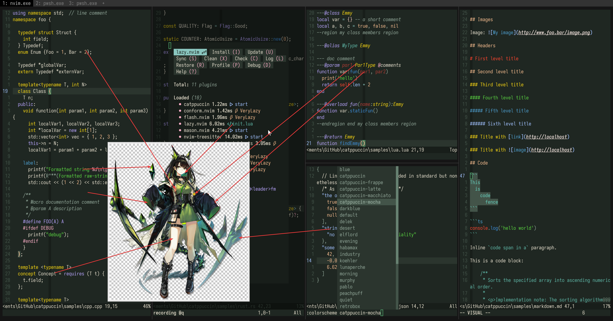

# mon3tr

- **角色:** Mon3tr
- **出处:** 《明日方舟》 (Arknights)
- **别名:** 读作 “Monster”
- **参考:** [Donmai Wiki](<https://donmai.moe/wiki_pages/mon3tr_(arknights)>), [PRTS](https://prts.wiki/w/Mon3tr)
- **序号:** `#2`

---

> 我对绿色角色没有特别的喜好，只是她碰巧是绿色，并且有一个和 nozomi 的 base 不一样的颜色。
我需要了解在绿色情况下这个 prompt 的鲁棒性。
>
> 2025-07-23: 在添加了 [凯尔希](../kal'tsit_(arknights)/README.md)后重做了 Mon3tr 的配色。这在语义上其实是难以理解的。

## 配色

完整的色彩数据存储在 [JSON](mon3tr.json) 文件中。

### 矩阵

对比度矩阵分析的原始数据为 [JSON 格式](mon3tr-contrast.json)（另提供一份 [仅与 base 对比的版本](mon3tr-base-contrast.json)），同时也提供了一份更易于阅读的 [Markdown 版本](mon3tr-contrast.md)。

### 来源

查看以下图片，这是不言自明的。



## 移植

### Neovim

<details>
  <summary>作为 catppuccin 的 mocha flavor</summary>

```lua
mocha = {
-- mon3tr	

    rosewater = "#f5e5e0",
    flamingo = "#f2c9c0",
    pink = "#ffb0c9",
    mauve = "#b8a4ff",
    red = "#FF442E",
    maroon = "#B03A33",
    peach = "#f7bd8f",
    yellow = "#fcd912",
    green = "#5ad641",
    teal = "#5fb8a8",
    sky = "#96d8d0",
    sapphire = "#4d9fd0",
    blue = "#3c8dd9",
    lavender = "#a1c1ff",


    text = "#e8e1cf",
    subtext0 = "#cdbe97",
    subtext1 = "#dacfb3",

    base = "#1f2722",
    mantle = "#181e1a",
    crust = "#111513",
    surface0 = "#313d35",
    surface1 = "#435449",
    surface2 = "#556b5d",
    overlay0 = "#678171",
    overlay1 = "#7b9685",
    overlay2 = "#92a89a",
},
```

</details>