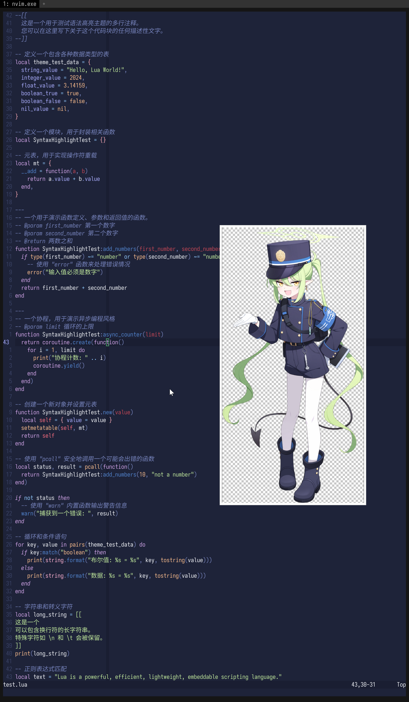

# nozomi

## 简介

《蔚蓝档案》中，一名来自海兰德铁道学院的学生和列车长。

她的全名是 `橘ノゾミ`。
她的罗马音名是 `Tachibana Nozomi`。
她的译名是`橘望`/`橘希望`。

她和她姐姐的名字来源于[東海旅客鉄道](https://ja.wikipedia.org/wiki/%E6%9D%B1%E6%B5%B7%E6%97%85%E5%AE%A2%E9%89%84%E9%81%93)运营的现实生活中的新干线列车“[のぞみ](<https://ja.wikipedia.org/wiki/%E3%81%AE%E3%81%9E%E3%81%BF_(%E5%88%97%E8%BB%8A)>)”和“[ひかり](<https://ja.wikipedia.org/wiki/%E3%81%B2%E3%81%8B%E3%82%8A_(%E5%88%97%E8%BB%8A)>)”。

## 配色

| 分类 | 名称      | Hex     | 设计思路                                      |
| ---- | --------- | ------- | --------------------------------------------- |
| 基础 | Crust     | #141827 | 制服最深阴影再加深，作为最底层背景减少眩光。  |
| 基础 | Mantle    | #1A1E32 | 在 Crust 之上稍亮一级，供大型面板或分栏使用。 |
| 基础 | Base      | #1E2339 | 取自制服主色并略微提亮，作为主要代码区背景。  |
| 基础 | Text      | #F2F4F8 | 来自她的白色裤袜，保证暗背景下的高对比正文。  |
| 语义 | Rosewater | #F4E0D7 | 以暖粉作柔和提示；取自肤色高光并减饱和。      |
| 语义 | Flamingo  | #F9A8B4 | 粉中带橙，表现调皮语气；Rosewater 增饱和。    |
| 语义 | Pink      | #FFB1D3 | 明艳粉，用于正向高亮；Flamingo 偏紫调。       |
| 语义 | Mauve     | #D1A4E8 | 紫粉混合，适合函数名；与制服蓝形成类比色。    |
| 语义 | Red       | #F66D7F | 高警示错误色；取粉色补色并提高饱和度。        |
| 语义 | Maroon    | #C04554 | Red 加黑加蓝，供严重错误或删除状态。          |
| 语义 | Peach     | #FBBD8D | 源自徽章金属光泽，添加橙调显活力。            |
| 语义 | Yellow    | #F7D76A | 直接取眼睛金黄并提亮，用于警告或标记。        |
| 语义 | Green     | #C0E89C | 从光环色 #eafac8 降低亮度，作成功状态。       |
| 语义 | Teal      | #B7EFD3 | 以光环色向青色旋转 30°，用于信息提示。        |
| 语义 | Sky       | #8FC8FF | 制服蓝提亮＋加青，表现轻盈悬浮元素。          |
| 语义 | Sapphire  | #366DB6 | 制服蓝降低亮度，强调选中或活动标签。          |
| 语义 | Blue      | #5082CC | 直接采样肩章条纹，用作主链接 / 关键词。       |
| 语义 | Lavender  | #AAADFF | Blue 向紫移并提亮，作为次级链接或配色平衡。   |

| Label | Hex | RGB | HSL (H°, S %, L %) | 计算要点 |
|-------|------|----------------|-------------------|-----------|
| Surface 0 | #2C334F | 44 , 51 , 79 | 229 °, 28 %, 24 % | Base +7 L，S -3 （承接 Catppuccin Mocha 规律） |
| Surface 1 | #3A4265 | 58 , 66 , 101 | 229 °, 27 %, 31 % | Base +14 L，S -4 |
| Surface 2 | #495279 | 73 , 82 , 121 | 229 °, 25 %, 38 % | Base +21 L，S -6 |
| Overlay 0 | #586393 | 88 , 99 , 147 | 229 °, 25 %, 46 % | Base +29 L，S -6 |
| Overlay 1 | #616EA8 | 97 , 110 , 168 | 229 °, 29 %, 52 % | Base +35 L，S -2 |
| Overlay 2 | #7683BC | 118 , 131 , 188 | 229 °, 34 %, 60 % | Base +43 L，S +3 |
| Subtext 1 | #DCDFE7 | 220 , 223 , 231 | 220 °, 19 %, 88 % | Text ×0.92 L，Text ×0.63 S |
| Subtext 0 | #C7CCD4 | 199 , 204 , 212 | 220 °, 12 %, 81 % | Text ×0.84 L，Text ×0.41 S |

## 移植

### Neovim

<!-- <details>
  <summary>修改 tokyonight.nvim</summary>

```Lua
{
    "folke/tokyonight.nvim",
    lazy = false,
    priority = 1000,
    opts = function()
        local styles = require("tokyonight.colors").styles
        styles.nozomi = vim.tbl_extend("force", styles.night, {
            bg = "#1E2339", -- Base
            bg_dark = "#141827", -- Crust
            bg_dark1 = "#1A1E32", -- Mantle
            bg_highlight = "#2C406D", -- Surface 2
            blue = "#3C6AFF", -- Blue
            blue0 = "#5980FF",
            blue1 = "#7696FF",
            blue2 = "#93ADFF",
            blue5 = "#B1C3FF",
            blue6 = "#CED9FF",
            blue7 = "#E1E8FF",
            comment = "#4964A0", -- Overlay 0
            cyan = "#8FC8FF", -- Sky
            dark3 = "#141C32",
            dark5 = "#0C111F",
            fg = "#F2F4F8", -- Text
            fg_dark = "#B3BAD0", -- Subtext 0
            fg_gutter = "#4964A0", -- Overlay 0
            green = "#C0E89C", -- Green
            green1 = "#CFF2B4",
            green2 = "#C6D4AA",
            magenta = "#FFB1D3", -- Pink
            magenta2 = "#F9A8B4", -- Flamingo
            orange = "#FBBD8D", -- Peach
            purple = "#D1A4E8", -- Mauve
            red = "#F66D7F", -- Red
            red1 = "#FF8888",
            teal = "#B7EFD3", -- Teal
            terminal_black = "#141827", -- Crust
            yellow = "#F7D76A", -- Yellow
            git = {
                add = "#C0E89C", -- Green
                change = "#5082CC", -- Blue
                delete = "#FF6B6B", -- Red
            },
        })

        return {
            style = "nozomi",
            transparent = false,
            styles = {
                sidebars = "transparent",
                floats = "transparent",
            },
        }
    end,
}
```

</details> -->

<details>
  <summary>修改 catppuccin</summary>

```Lua
latte = {
    crust = "#141827",
    mantle = "#1A1E32",
    base = "#1E2339",
    surface0 = "#2C334F",
    surface1 = "#3A4265",
    surface2 = "#495279",
    overlay0 = "#586393",
    overlay1 = "#616EA8",
    overlay2 = "#7683BC",
    text = "#F2F4F8",
    subtext0 = "#DCDFE7",
    subtext1 = "#C7CCD4",

    rosewater = "#F4E0D7",
    flamingo = "#F9A8B4",
    pink = "#FFB1D3",
    mauve = "#D1A4E8",
    red = "#F66D7F",
    maroon = "#C04554",
    peach = "#FBBD8D",
    yellow = "#F7D76A",
    green = "#C0E89C",
    teal = "#B7EFD3",
    sky = "#8FC8FF",
    sapphire = "#366DB6",
    blue = "#5082CC",
    lavender = "#AAADFF",
},
```

</details>



## 生成

要生成，需要和此角色的立绘一起发送至 ChatGPT-o3 中。

此调色板作成时还未引入梯度概念，故需要进行 CoT。

<details>
  <summary>查看 prompt</summary>

```md
你是一个专业 UI 设计师，尤其擅长为开发者工具创造富有情感联系和视觉一致性的主题。

我希望你根据一个动漫角色的核心色系，为我创作一个专门用于代码编辑器的“暗黑模式” (Dark Mode) 调色板。这个调色板必须严格遵循下方指定的命名结构。

### 1. 角色与风格分析

橘ノゾミ、ハイランダー鉄道学園所属、CCC（中央管制センター）の幹部。陽気かつハツラツとした性格で、細かいことは気にしない。そのせいか、双子の姉であるヒカリと一緒にトラブルを引き起こすこともしばしば。面白そうなものにはとりあえず飛び込む性格だが、列車運行に関しては責任を持って臨んでいる。

这要求调色板在整体沉稳专业的基调上，必须拥有明亮、充满活力的强调色。

### 2. 核心颜色基准

在 Blue Archive 中，光环相当于学生的生命。如果光环破碎，学生就会死亡。她的光环颜色是 #eafac8。
除此之外，还有如下几点：

- 背景色 (base)：她的制服颜色，可以选择比立绘更深一点的蓝色。
- 文本色 (text)：可以从她的裤袜得到灵感。
- 黄色系：她的眼睛是黄色的，以及她身上的某些物品是金色的。

### 3. 设计任务与色彩学要求

请根据上述**核心颜色基准**，填充以下的调色板结构。

- 推断原则：你需要基于核心颜色，运用专业的色彩学知识（如调整饱和度、亮度，寻找邻近色、互补色）来生成剩余的颜色。所有颜色组合在一起时，必须感觉它们源自同一个角色。
- 风格指令：
  - 基础色 (Base, Mantle, Crust, Surface 0, Surface 1, Surface 2, Overlay 0, Overlay 1, Overlay 2): 必须沉稳、专业，以制服颜色为基础进行微调，确保长时间阅读的舒适性。对于 Surface 和 Overlay，数字越大则越亮。
  - 文本色 (Text, Subtext 0, Subtext 1): 必须清晰易读，以她的裤袜为基础，可以创建不同亮度的版本。对于 Subtext，数字越大则越亮。
  - 语义色: 必须体现角色“陽気かつハツラツ”的性格。它们需要比基础色更鲜明，但又不能过于刺眼。
    - `Green`, `Teal` 应从光环色 `#eafac8` 演变而来。
    - `Blue`, `Sapphire`, `Sky`, `Lavender` 需要你根据现有颜色进行和谐的创造，以补全整个色谱。
    - `Yellow`、`Peach` 应从她的眼睛颜色或配饰演变而来。
    - `Red`, `Maroon`, `Mauve`, `Pink`, `Flamingo`, `Rosewater` 应该使用色彩学知识来生成。

### 4. 输出格式

请以 Markdown 表格的形式返回最终的调色板，包含以下列：

- 分类 (Category): 语义 (Semantic) 或 基础 (Base)
- 名称 (Name): 如 Rosewater, Base 等
- 设计思路 (Rationale): 简要说明这个颜色的灵感来源或推导逻辑（例如：“源自金色纽扣颜色，增加了亮度以体现活泼感”）。
```

</details>
