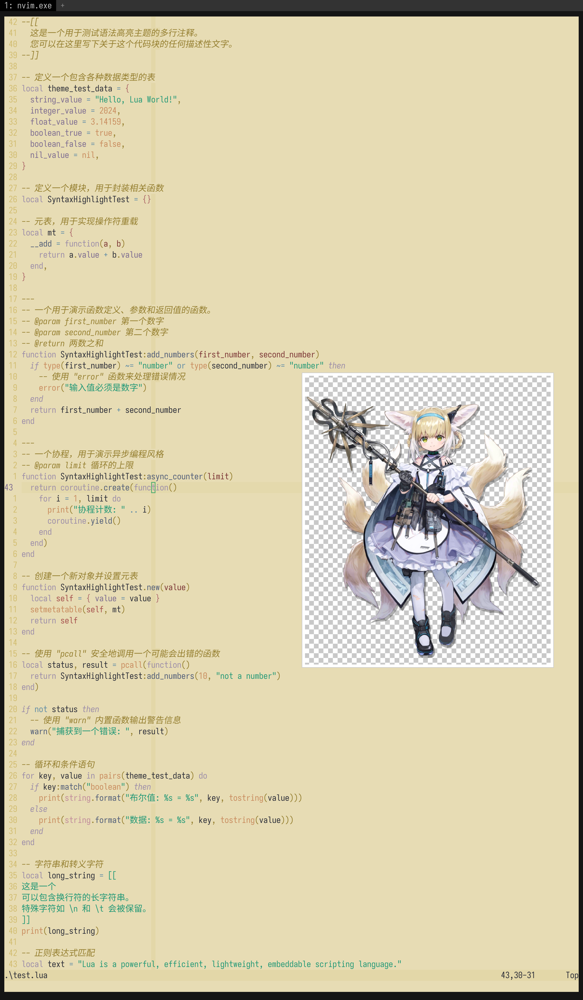

# suzuran

## 简介

《明日方舟》中，一名基于九尾狐设计的角色。

-   她的名字是`铃兰`。她的译名是 `Suzuran`，日文译名是`スズラン`。她的本名是`丽萨`，译名为 `Lisa`、`リサ`。

铃兰是这个项目的第 3 个角色。

尝试做一个 light theme，挑上铃兰（或所谓的“大家的光”）算是合适的。然而，可能是因为 o3 的模型更熟悉 dark theme 的用法，导致我多次尝试 prompt，都未能选出理想的语义化颜色。

一开始我是喂了她的 4 个时装进去的，但是这直接导致 o3 的 python 环境崩溃，导致它一直重启它的环境，最后思考时间超过 12 分钟之后直接卡死，过程非常有趣。

后来，我改为仅使用她的默认时装，这才基本成功。在确定基础语义色之后，还要让它学习 `kanagawa` 或 `everforest`，这样才勉强能成一个能使用的主题。

在此，还要让 o3 从 HSL 上思考，才能添加成功率。事实上，只要取几个角色身上的颜色，保证 Hue/Sat 完全来自角色，调整一下 L，就差不多算是一个 character-inspired theme 了。

## 配色

| 分类 | 名称      | Hex         | 设计思路                            |
| ---- | --------- | ----------- | ----------------------------------- |
| 基础 | Base      | **#E7DCB4** | 取毛发高光；L≈81 %。                |
| 基础 | Mantle    | #E3D7A8     | −3 L，侧边栏底色。                  |
| 基础 | Crust     | #E0D19D     | −6 L，最外层分隔线。                |
| 基础 | Surface0  | #D8C686     | −12 L，主内容卡片。                 |
| 基础 | Surface1  | #D1BC6E     | −18 L，浮层背板。                   |
| 基础 | Surface2  | #C9B157     | −24 L，选区高亮。                   |
| 基础 | Overlay0  | #C2A640     | −30 L，行号栏。                     |
| 基础 | Overlay1  | #AC9337     | −36 L，弱边框。                     |
| 基础 | Overlay2  | #957F30     | −42 L，阴影/滚动条。                |
| 基础 | Text      | **#292B36** | 战术背心深灰；对比度 ≈ 10 : 1。     |
| 基础 | Subtext 1 | #363947     | Text +6 L，次级文字。               |
| 基础 | Subtext 0 | #434759     | Text +12 L，注释/占位。             |
| 语义 | Rosewater | #B87E7D     | 耳尖粉降至 L≈27 %，柔和删除行背景。 |
| 语义 | Flamingo  | #B06D6C     | Rosewater 再暗 1 级，用于轻警告。   |
| 语义 | Pink      | #C08A9B     | 粉灰加紫调，标签/宏名。             |
| 语义 | Mauve     | #9B8CA8     | Pink 顺时针 +20° Hue，装饰符号。    |
| 语义 | Red       | #A54F4C     | 深红棕，Error / throw。             |
| 语义 | Maroon    | #7A3333     | Red 再 −15 L，严重错误。            |
| 语义 | Peach     | #C88B5D     | 发梢金橙调暗，Git Change。          |
| 语义 | Yellow    | #9E8244     | 暗金芥末，Git Warning / diag Warn。 |
| 语义 | Green     | #219876     | 眼睛翠绿直接取样，Git Add / OK。    |
| 语义 | Teal      | #4F8F82     | 将发带蓝旋 −30° 得青绿，注释边框。  |
| 语义 | Sky       | #608CA6     | 发带蓝提 G B，信息提示。            |
| 语义 | Sapphire  | #324863     | 发带蓝 −15 L，按钮 Hover。          |
| 语义 | Blue      | **#4E5B77** | 发带原蓝调暗至 L≈38 %，主行动色。   |
| 语义 | Lavender  | #7B6A90     | Blue +60° Hue 生成柔紫，选中 Tab。  |

## 移植

### Neovim

<details>
  <summary>修改 catppuccin</summary>

```lua
latte = {
	base = "#E7DCB4",
	mantle = "#E3D7A8",
	crust = "#E0D19D",
	surface0 = "#D8C686",
	surface1 = "#D1BC6E",
	surface2 = "#C9B157",
	overlay0 = "#C2A640",
	overlay1 = "#AC9337",
	overlay2 = "#957F30",
	text = "#292B36",
	subtext1 = "#363947",
	subtext0 = "#434759",

	rosewater = "#B87E7D",
	flamingo = "#B06D6C",
	pink = "#C08A9B",
	mauve = "#9B8CA8",
	red = "#A54F4C",
	maroon = "#7A3333",
	peach = "#C88B5D",
	yellow = "#9E8244",
	green = "#219876",
	teal = "#4F8F82",
	sky = "#608CA6",
	sapphire = "#324863",
	blue = "#4E5B77",
	lavender = "#7B6A90",
},
```



</details>

## 生成

要生成，需要和此角色的立绘（默认时装、精英零）一起发送至 ChatGPT-o3 中。

此调色板作成时还未引入梯度概念，故需要进行 CoT。

<details>
  <summary>查看 prompt</summary>
  
```md
你是一个专业UI设计师，尤其擅长为开发者工具创造富有情感联系和视觉一致性的主题。

我希望你根据一个动漫角色的核心色系，为我创作一个专门用于代码编辑器的 Light Mode 调色板。这个调色板必须严格遵循下方指定的命名结构。

### 1. 角色与风格分析

-   角色名: Suzuran (本名 Lisa、译名铃兰)
-   出处: Arknights
-   核心性格与气质: Lisa is a wonderful and well-behaved child! I mean, after taking care of so many strong-willed people, it's rare to meet such a well-mannered and sensible child. Of course this is my personal belief. Despite the unfortunate fact that Lisa was infected at such a young age, she still has such a strong and pure aspect to her that I can't even begin to comprehend what her parents went through to shield her from that kind of environment. Of course, Lisa may also show us the bright future that lies ahead.

-   期望的调色板感觉: 应该是一个黄色背景，配上她的服装语义色的主题。她上了 Rhodes Island 以后，被称为“大家的光”，所以这是一个 light 主题。
-   文件结构：suzuran_0.png 是她的立绘。

### 2. 核心颜色基准

-   主要基调色 (用于背景): 观察 suzuran_0.png 她的毛发，显然她的毛发都是黄色的，提取这种黄色来当作 base。
-   核心文本色 (用于文字): 对于文字色，应该是她身上装备的黑色综合起来的一种颜色作为 text。
-   第一强调色 (最标志性的颜色): 她头上的带子是蓝色的。
-   第二强调色 (次要特色): 她的眼睛是绿色的。

### 3. 设计任务与色彩学要求

请根据上述**核心颜色基准**，填充以下的调色板结构。

-   推断原则：你需要基于核心颜色，运用专业的色彩学知识（如调整饱和度、亮度，寻找邻近色、互补色）来生成剩余的颜色。所有颜色组合在一起时，必须感觉它们源自同一个角色。
-   风格指令：
    -   基础色 (Base, Mantle, Crust, Surface 0, Surface 1, Surface 2, Overlay 0, Overlay 1, Overlay 2): 以**主要基调色 (base)**为基础进行微调，确保长时间阅读的舒适性。对于 Surface 和 Overlay，数字越大则越暗。具体梯度需要参看 # 4. Catppuccin 梯度示例。
    -   文本色 (Text, Subtext 0, Subtext 1): 以**核心文本色 (text)**为基础创建不同亮度的版本，确保清晰易读。对于 Subtext，数字越大则越暗。具体梯度需要参看 # 4. Catppuccin 梯度示例。
    -   语义色: 必须体现用户描述的**核心性格与气质**。它们需要比基础色更鲜明，但又不能过于刺眼。
        -   蓝色系包含：Blue、Sapphire、Sky、Teal、Lavender。她的衣服有蓝色的部分，提取和统计这种蓝色，然后再根据专业色彩学知识进行变化，最后生成。
        -   红色系包含：Red、Maroon、Flamingo、Rosewater。这些需要通过专业色彩学知识变化并生成。
        -   黄色系包含：Yellow、Peach。对于 base 已经是黄色的情况，你需要查看立绘，找出和提取压暗（但不是趋于黑色）的 Yellow。Peach 可以选择用专业的色彩学知识生成。
        -   绿色系包含：Green。她的眼睛显然是绿色的。你可以从 suzuran_0.png 中提取和统计出来，为了长时间阅读性可以变化。
        -   剩下 Mauve、Lavender、Pink 可以提取她的耳朵的粉色，使用专业的色彩学知识变化后生成。

### 4. 提取颜色

你必须首先使用图像分析工具从提供的图片中**提取核心色值（以 RGB/HEX 表示）**。你不得仅凭印象或描述生成颜色。你必须使用 Python 工具或其他方式从指定部位提取颜色。

你需要利用以下图像文件：

-   `suzuran_0.png`

### 5. Catppuccin 梯度示例

下表展示 Latte 口味中 _Base ⇢ Surface/Overlay/Mantle/Crust_ 与 _Text ⇢ Subtext_ 的精确梯度。  
请在生成新调色板时「复用同样的相对增量」，但以本角色的 Base / Text 作为起点。

| Labels   | Hex       | RGB                  | HSL                  |
| -------- | --------- | -------------------- | -------------------- |
| Text     | `#4c4f69` | `rgb(76, 79, 105)`   | `hsl(234, 16%, 35%)` |
| Subtext1 | `#5c5f77` | `rgb(92, 95, 119)`   | `hsl(233, 13%, 41%)` |
| Subtext0 | `#6c6f85` | `rgb(108, 111, 133)` | `hsl(233, 10%, 47%)` |
| Overlay2 | `#7c7f93` | `rgb(124, 127, 147)` | `hsl(232, 10%, 53%)` |
| Overlay1 | `#8c8fa1` | `rgb(140, 143, 161)` | `hsl(231, 10%, 59%)` |
| Overlay0 | `#9ca0b0` | `rgb(156, 160, 176)` | `hsl(228, 11%, 65%)` |
| Surface2 | `#acb0be` | `rgb(172, 176, 190)` | `hsl(227, 12%, 71%)` |
| Surface1 | `#bcc0cc` | `rgb(188, 192, 204)` | `hsl(225, 14%, 77%)` |
| Surface0 | `#ccd0da` | `rgb(204, 208, 218)` | `hsl(223, 16%, 83%)` |
| Base     | `#eff1f5` | `rgb(239, 241, 245)` | `hsl(220, 23%, 95%)` |
| Mantle   | `#e6e9ef` | `rgb(230, 233, 239)` | `hsl(220, 22%, 92%)` |
| Crust    | `#dce0e8` | `rgb(220, 224, 232)` | `hsl(220, 21%, 89%)` |

如果不遵循梯度的话，部分 UI 会看不清字。

### 6. 输出格式

请以 Markdown 表格的形式返回最终的调色板，包含以下列：

-   分类 (Category): 语义 (Semantic) 或 基础 (Base)
-   名称 (Name): 如 Rosewater, Base 等
-   Hex
-   设计思路 (Rationale): 简要说明这个颜色的灵感来源或推导逻辑（例如：“源自金色纽扣颜色，增加了亮度以体现活泼感”）。

````

```md

这是一个light theme。你提供的语义色太亮了，以至于我都看不清base上面的颜色。

你可以参考和计算出 everforest 和 kanagawa 的fg与bg规律，然后照抄它们的规律。但是不能照抄它们的配色，因为要有suzuran的个人特色在。比如，发带原蓝色可以适当调暗，如此。

everforest bg

*   #EFEBD4
*   #FDF6E3
*   #F4F0D9
*   #EFEBD4
*   #E6E2CC
*   #E0DCC7
*   #BDC3AF
*   #EAEDC8
*   #FBE3DA
*   #F0F1D2
*   #E9F0E9
*   #FAEDCD

everforest fg

### **text**
*   #5C6A72

### **语义**
*   #F85552
*   #F57D26
*   #DFA000
*   #8DA101
*   #35A77C
*   #3A94C5
*   #DF69BA

### **subtext参考**
*   #A6B0A0
*   #939F91
*   #829181

### **git参考**
*   #93B259
*   #708089
*   #E66868

kanagawa.nvim

|               |           |                                                  |
| ------------- | --------- | ------------------------------------------------ |
| autumnGreen   | `#76946A` | Git Add                                          |
| autumnRed     | `#C34043` | Git Delete                                       |
| autumnYellow  | `#DCA561` | Git Change                                       |
| samuraiRed    | `#E82424` | Diagnostic Error                                 |
| roninYellow   | `#FF9E3B` | Diagnostic Warning                               |
| waveAqua1     | `#6A9589` | Diagnostic Info                                  |
| dragonBlue    | `#658594` | Diagnostic Hint                                  |
| fujiGray      | `#727169` | Comments                                         |
| springViolet1 | `#938AA9` | Light foreground                                 |
| oniViolet     | `#957FB8` | Statements and Keywords                          |
| crystalBlue   | `#7E9CD8` | Functions and Titles                             |
| springViolet2 | `#9CABCA` | Brackets and punctuation                         |
| springBlue    | `#7FB4CA` | Specials and builtin functions                   |
| lightBlue     | `#A3D4D5` | Not used                                         |
| waveAqua2     | `#7AA89F` | Types                                            |
| springGreen   | `#98BB6C` | Strings                                          |
| boatYellow1   | `#938056` | Not used                                         |
| boatYellow2   | `#C0A36E` | Operators, RegEx                                 |
| carpYellow    | `#E6C384` | Identifiers                                      |
| sakuraPink    | `#D27E99` | Numbers                                          |
| waveRed       | `#E46876` | Standout specials 1 (builtin variables)          |
| peachRed      | `#FF5D62` | Standout specials 2 (exception handling, return) |
| surimiOrange  | `#FFA066` | Constants, imports, booleans                     |
| katanaGray    | `#717C7C` | Deprecated                                       |
````

</details>
