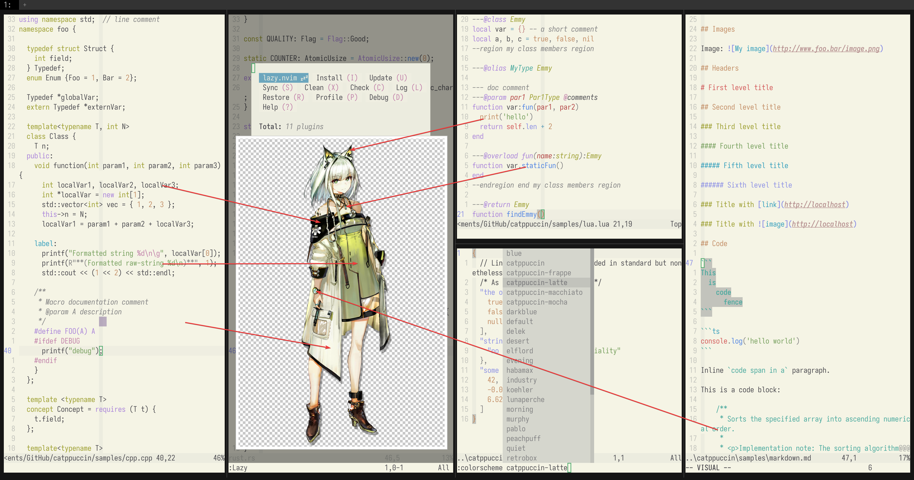

# Kal'tsit

- **Character:** Kal'tsit
- **Source:** Arknights
- **Alias:** `凯尔希` (CN), `Kal'tsit` (EN), `ケルシー` (JP)
- **Reference:** [Donmai Wiki](<https://donmai.moe/wiki_pages/arknights_kaltsit>), [PRTS](https://prts.wiki/w/%E5%87%AF%E5%B0%94%E5%B8%8C)
- **Index:** `#4`

---

> `Kal'tsit` is the 4th character in this project. When working on this character, JSON and automation scripts were introduced. Compared to the first three, this is almost the most successful one.
>
> The JSON structure design, contrast results, semantic color fine-tuning... it wasn't until this character that a workflow was formed.
>
> Interestingly, this is definitely more successful than [Mon3tr](../arknights_mon3tr/README.md), but semantically, Mon3tr should be the dark mode for kaltsit.

## Palette

The complete color data is stored in the [JSON](./palette.json) file.

The JSON format suitable for Whiskers is stored in [palette-whiskers.json](./palette-whiskers.json).

### Matrix

The raw data for the contrast matrix analysis is in [JSON format](./contrast-matrix.json) (another version with [only base comparison](./contrast-base.json) is also provided), and a more readable [Markdown version](./contrast-report.md) is also available.

### Source

Look at the following image, it's self-explanatory.



## Porting

### Neovim

<details>
	<summary>As catppuccin's latte flavor</summary>

```lua
require("catppuccin").setup {
    color_overrides = {
        latte = {
        rosewater= "#B58F8F",
        flamingo = "#C28483",
        pink     = "#C180A9",
        mauve    = "#AA84DA",
        red      = "#D35B5B",
        maroon   = "#B24444",
        peach    = "#C38E66",
        yellow   = "#9C9E2F",
        green    = "#77A05E",
        sky      = "#5D9DB8",
        sapphire = "#359FBD",
        blue     = "#4F83E3",
        lavender = "#8D91E5",
        text     = "#4C4B50",
        subtext0 = "#6C6B6C",
        subtext1 = "#5C5B5E",
        base     = "#F5F4E5",
        mantle   = "#ECECDF",
        crust    = "#E2E3D8",
        surface0 = "#D2D3CA",
        surface1 = "#C2C3BC",
        surface2 = "#B2B3AE",
        overlay0 = "#A2A3A0",
        overlay1 = "#929291",
        overlay2 = "#828283",
        },
    }
}
```

</details>
