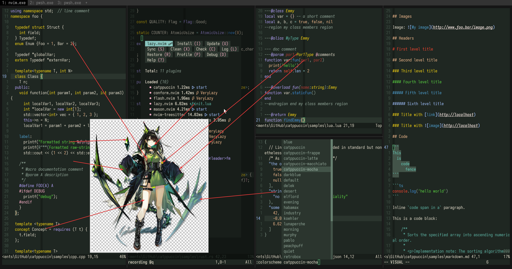

# mon3tr

- **Character:** Mon3tr
- **Source:** Arknights
- **Alias:** Read as "Monster"
- **Reference:** [Donmai Wiki](https://donmai.moe/wiki_pages/arknights_mon3tr), [PRTS](https://prts.wiki/w/Mon3tr)
- **Index:** `#2`

---

> I don't have a particular preference for green characters, it's just that she happens to be green and has a different base color from Nozomi.
> I need to understand the robustness of this prompt in a green scenario.
>
> 2025-07-23: Reworked Mon3tr's color scheme after adding [Kal'tsit](../arknights_kaltsit/README.md). This is semantically difficult to understand.

## Palette

The complete color data is stored in the [JSON](./palette.json) file.

The JSON format suitable for Whiskers is stored in [palette-whiskers.json](./palette-whiskers.json).

### Matrix

The raw data for the contrast matrix analysis is in [JSON format](./contrast-matrix.json) (another version with [only base comparison](./contrast-base.json) is also provided), and a more readable [Markdown version](./contrast-report.md) is also available.

### Source

Look at the following image, it's self-explanatory.



## Porting

### Neovim

<details>
  <summary>As catppuccin's mocha flavor</summary>

```lua
require("catppuccin").setup {
    color_overrides = {
        mocha = {
        rosewater= "#f5e5e0",
        flamingo = "#f2c9c0",
        pink     = "#ffb0c9",
        mauve    = "#b8a4ff",
        red      = "#FF442E",
        maroon   = "#B03A33",
        peach    = "#f7bd8f",
        yellow   = "#fcd912",
        green    = "#5ad641",
        teal     = "#5fb8a8",
        sky      = "#96d8d0",
        sapphire = "#4d9fd0",
        blue     = "#3c8dd9",
        lavender = "#a1c1ff",
        text     = "#e8e1cf",
        subtext0 = "#cdbe97",
        subtext1 = "#dacfb3",
        base     = "#1f2722",
        mantle   = "#181e1a",
        crust    = "#111513",
        surface0 = "#313d35",
        surface1 = "#435449",
        surface2 = "#556b5d",
        overlay0 = "#678171",
        overlay1 = "#7b9685",
        overlay2 = "#92a89a",
        },
    }
}
```

</details>
