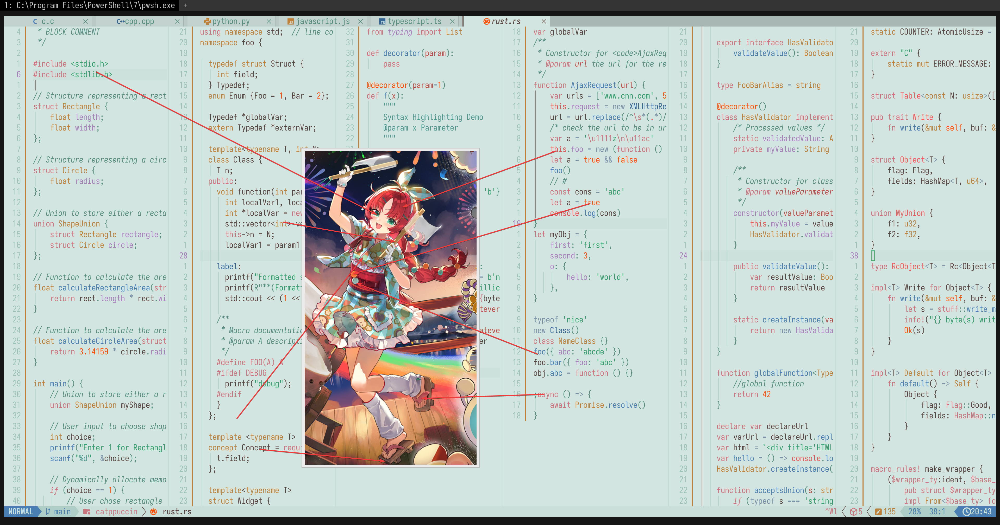

# myrtle (bustling festival)

- **角色:** 桃金娘（繁闹祭典）
- **出处:** 《明日方舟》 (Arknights)
- **别名:** `天人花` (CN), `Myrtle` (EN), `テンニンカ` (JP)
- **参考:** [Donmai Wiki](<https://donmai.moe/wiki_pages/myrtle_(arknights)>), [PRTS](https://prts.wiki/w/%E6%A1%83%E9%87%91%E5%A8%98)
- **序号:** `#9`

---

> `桃金娘（繁闹祭典）` 是这个项目的第 9 个角色。
>
> 本来是想做一个 Dark theme 的，但是并没有一个好的背景色，所以直接做 Light theme。

## 配色

完整的色彩数据存储在 [JSON](./palette.json) 文件中。

### 矩阵

对比度矩阵分析的原始数据为 [JSON 格式](./contrast-matrix.json)（另提供一份 [仅与 base 对比的版本](./contrast-base.json)），同时也提供了一份更易于阅读的 [Markdown 版本](./contrast-report.md)。

### 来源

查看以下图片，这是不言自明的。



## 移植

### Neovim

<details>
	<summary>作为 catppuccin 的 latte flavor</summary>

```lua
require("catppuccin").setup {
    color_overrides = {
        latte = {
        rosewater= "#d0755b",
        flamingo = "#f15c5c",
        pink     = "#ca757d",
        mauve    = "#d0727c",
        red      = "#e75454",
        maroon   = "#be4f48",
        peach    = "#fe4f06",
        yellow   = "#bf8037",
        green    = "#329f6b",
        teal     = "#4f9a91",
        sky      = "#7991a7",
        sapphire = "#356593",
        blue     = "#497fb2",
        lavender = "#a97ebc",
        text     = "#5a4540",
        subtext0 = "#7a5d56",
        subtext1 = "#6b524c",
        base     = "#d3e5e1",
        mantle   = "#cadfda",
        crust    = "#c0d9d3",
        surface0 = "#adcdc6",
        surface1 = "#9ac2b9",
        surface2 = "#87b6ab",
        overlay0 = "#74ab9e",
        overlay1 = "#619f91",
        overlay2 = "#558d80",
        },
    }
}
```

</details>
