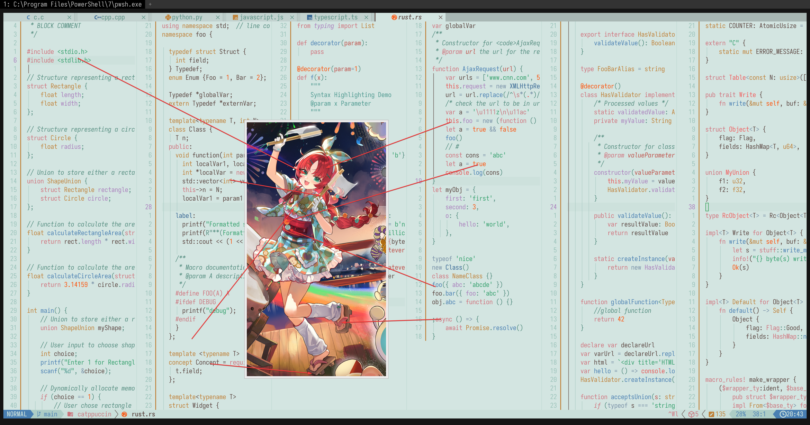

# myrtle (bustling festival)

- **角色:** 桃金娘（繁闹祭典）
- **出处:** 《明日方舟》 (Arknights)
- **别名:** `Myrtle (Bustling Festival)` (EN), `テンニンカ (にぎやかなお祭り)` (JP)
- **参考:** [Donmai Wiki](<https://donmai.moe/wiki_pages/myrtle_(arknights)>), [PRTS](https://prts.wiki/w/%E6%A1%83%E9%87%91%E5%A8%98)
- **序号:** `#9`

---

> `桃金娘（繁闹祭典）` 是这个项目的第 9 个角色。
>
> 本来是想做一个 Dark theme 的，但是并没有一个好的背景色，所以直接做 Light theme。

## 配色

完整的色彩数据存储在 [JSON](./palette.json) 文件中。

适用于 Whiskers 的 JSON 格式存储在 [palette-whiskers.json](./palette-whiskers.json) 中。

### 矩阵

对比度矩阵分析的原始数据为 [JSON 格式](./contrast-matrix.json)（另提供一份 [仅与 base 对比的版本](./contrast-base.json)），同时也提供了一份更易于阅读的 [Markdown 版本](./contrast-report.md)。

### 来源

查看以下图片，这是不言自明的。

