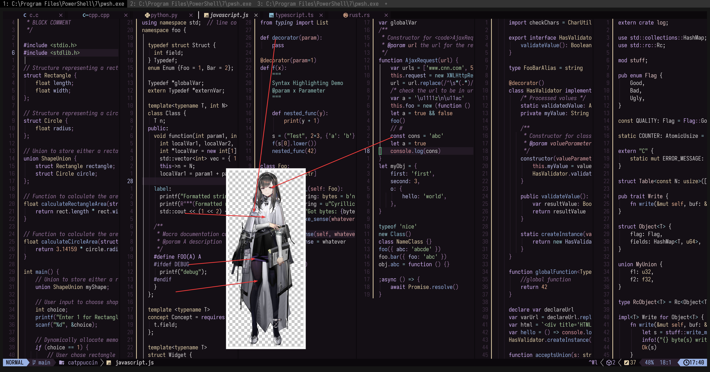

# Priestess

- **角色:** 普瑞赛斯
- **出处:** 《明日方舟》 (Arknights)
- **别名:** `Priestess` (EN), `プリースティス` (JP)
- **参考:** [Donmai Wiki](<https://donmai.moe/wiki_pages/arknights_priestess>), [萌娘百科](https://zh.moegirl.org.cn/zh-hans/%E6%99%AE%E7%91%9E%E8%B5%9B%E6%96%AF)
- **序号:** `#5`

---

> `普瑞赛斯` 是这个项目的第 5 个角色。
>
> 第一版和 [Helix](https://helix-editor.com/) 长得非常像，所以调低了亮度。
> 可惜的是，这并不妨碍它还是和调低亮度的 Helix 长得像。
>
> 做这个角色是为了测试一个紫色底的主题。从抄袭嫌疑上看，这似乎是较为失败的。

## 配色

完整的色彩数据存储在 [JSON](./palette.json) 文件中。

适用于 Whiskers 的 JSON 格式存储在 [palette-whiskers.json](./palette-whiskers.json) 中。

### 矩阵

对比度矩阵分析的原始数据为 [JSON 格式](./contrast-matrix.json)（另提供一份 [仅与 base 对比的版本](./contrast-base.json)），同时也提供了一份更易于阅读的 [Markdown 版本](./contrast-report.md)。

### 来源

查看以下图片，这是不言自明的。



## 移植

### Neovim

<details>
	<summary>作为 catppuccin 的 macchiato flavor</summary>

```lua
require("catppuccin").setup {
    color_overrides = {
        macchiato = {
        rosewater= "#EFDDDA",
        flamingo = "#E9CCCC",
        pink     = "#AF9FCE",
        mauve    = "#D5B3F8",
        red      = "#DD96A0",
        maroon   = "#E1A5AA",
        peach    = "#E3AE90",
        yellow   = "#E2CFAA",
        green    = "#ABCF9F",
        teal     = "#96C9C2",
        sky      = "#9DCED6",
        sapphire = "#8CBED4",
        blue     = "#99B2E4",
        lavender = "#C0C4EE",
        text     = "#DAD7D9",
        subtext0 = "#B2ACB0",
        subtext1 = "#C6C1C4",
        base     = "#140F15",
        mantle   = "#0B080C",
        crust    = "#030203",
        surface0 = "#2A1F2D",
        surface1 = "#413045",
        surface2 = "#553F5A",
        overlay0 = "#6C5072",
        overlay1 = "#82608A",
        overlay2 = "#97749E",
        },
    }
}
```

</details>
