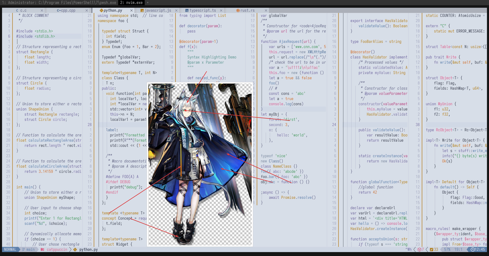

# Rosmontis

- **角色:** 迷迭香
- **出处:** Arknights
- **别名:** `纳西莎` (CN), `Rosmontis`、`Narcissa` (EN), `ロスモンティス`、`ナルシッサ` (JP)
- **参考:** [Donmai Wiki](<https://donmai.moe/wiki_pages/rosmontis_(arknights)>), [PRTS](https://prts.wiki/w/%E8%BF%B7%E8%BF%AD%E9%A6%99)
- **序号:** `#10`

---

> `迷迭香` 是这个项目的第 10 个角色。

## 配色

完整的色彩数据存储在 [JSON](./palette.json) 文件中。

适用于 Whiskers 的 JSON 格式存储在 [palette-whiskers.json](./palette-whiskers.json) 中。

### 矩阵

对比度矩阵分析的原始数据为 [JSON 格式](./contrast-matrix.json)（另提供一份 [仅与 base 对比的版本](./contrast-base.json)），同时也提供了一份更易于阅读的 [Markdown 版本](./contrast-report.md)。

### 来源

查看以下图片，这是不言自明的。



## 移植

### Neovim

<details>
	<summary>作为 catppuccin 的 latte flavor</summary>

```lua
require("catppuccin").setup {
	color_overrides = {
		latte = {
			rosewater = "#d76787",
			flamingo = "#dd608d",
			pink = "#d96489",
			mauve = "#6c699f",
			red = "#d65b91",
			maroon = "#b84681",
			peach = "#d1732f",
			yellow = "#b3821f",
			green = "#469b60",
			teal = "#5a9591",
			sky = "#7d8da2",
			sapphire = "#4c6c94",
			blue = "#5e81ac",
			lavender = "#7c79a9",
			text = "#3b4251",
			subtext1 = "#4a5161",
			subtext0 = "#5a616f",
			overlay2 = "#636986",
			overlay1 = "#727896",
			overlay0 = "#838aa4",
			surface2 = "#939bb2",
			surface1 = "#a4abc1",
			surface0 = "#b5bcce",
			base = "#d8dee8",
			mantle = "#ced5e3",
			crust = "#c5cddd",
		},
	}
}
```

</details>
