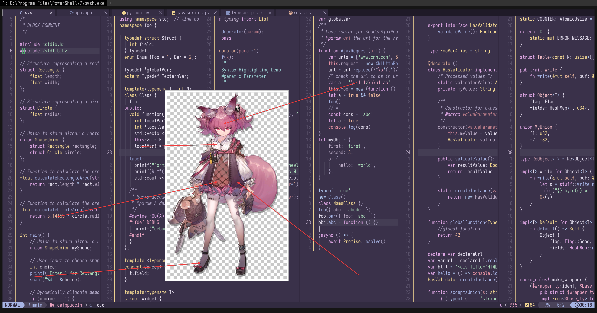

# Kal'tsit

- **角色:** 巫恋
- **出处:** 《明日方舟》 (Arknights)
- **别名:** `Shamare` (EN), `シャマレ` (JP)
- **参考:** [Donmai Wiki](<https://donmai.moe/wiki_pages/shamare_(arknights)>), [PRTS](https://prts.wiki/w/%E5%B7%AB%E6%81%8B)
- **序号:** `#7`

---

> `凯尔希` 是这个项目的第 7 个角色。

## 配色

完整的色彩数据存储在 [JSON](./palette.json) 文件中。

### 矩阵

对比度矩阵分析的原始数据为 [JSON 格式](./contrast-matrix.json)（另提供一份 [仅与 base 对比的版本](./contrast-base.json)），同时也提供了一份更易于阅读的 [Markdown 版本](./contrast-report.md)。

### 来源

查看以下图片，这是不言自明的。



## 移植

### Neovim

<details>
	<summary>作为 catppuccin 的 frappe flavor</summary>

```lua
require("catppuccin").setup {
    color_overrides = {
        frappe = {
        rosewater= "#F2CED5",
        flamingo = "#EFB9C3",
        pink     = "#E8A2C0",
        mauve    = "#DDA6E3",
        red      = "#E591A2",
        maroon   = "#B97C88",
        peach    = "#E8B49A",
        yellow   = "#F0D591",
        green    = "#A9D8B8",
        teal     = "#9ACECF",
        sky      = "#B3CBF2",
        sapphire = "#8793C2",
        blue     = "#A6B3E3",
        lavender = "#B8A9C3",
        text     = "#E2DCEC",
        subtext0 = "#BCB3C9",
        subtext1 = "#CFC5DD",
        base     = "#3A314A",
        mantle   = "#322B41",
        crust    = "#2A2436",
        surface0 = "#4A435A",
        surface1 = "#5B536C",
        surface2 = "#6C647D",
        overlay0 = "#817896",
        overlay1 = "#9288A8",
        overlay2 = "#A89FBD",
        },
    }
}
```

</details>
