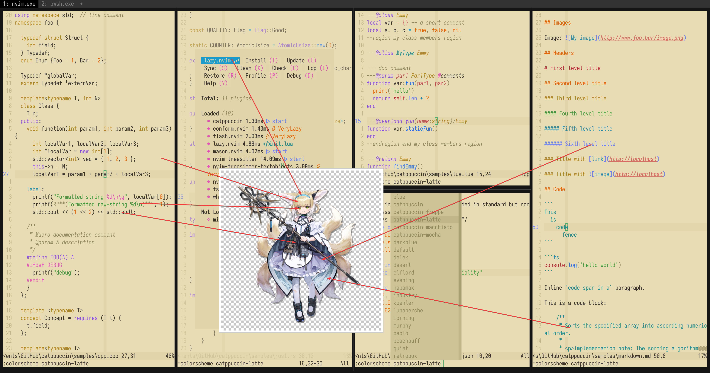

# Suzuran

- **Character:** Suzuran
- **Source:** Arknights
- **Alias:** `铃兰` (CN), `丽萨` (Real Name), `Suzuran`, `Lisa` (EN), `スズラン`, `リサ` (JP)
- **Reference:** [Donmai Wiki](<https://donmai.moe/wiki_pages/arknights_suzuran>), [PRTS](https://prts.wiki/w/%E9%93%83%E5%85%B0)
- **Index:** `#2`

---

> Suzuran is the 3rd character in this project.
>
> This time I tried to make a light theme, and choosing Suzuran (or the so-called "everyone's light") was appropriate. However, perhaps because the o3 model is more familiar with the usage of dark themes, I tried the prompt multiple times but failed to select the ideal semantic colors.
> At first, I fed it her 4 outfits, but this directly caused the o3 python environment to crash, causing it to keep restarting its environment, and finally it got stuck after thinking for more than 12 minutes, which was a very interesting process.
> Later, I switched to using only her default outfit, and it was basically successful.

## Palette

The complete color data is stored in the [JSON](./palette.json) file.

The JSON format suitable for Whiskers is stored in [palette-whiskers.json](./palette-whiskers.json).

### Matrix

The raw data for the contrast matrix analysis is in [JSON format](./contrast-matrix.json) (another version with [only base comparison](./contrast-base.json) is also provided), and a more readable [Markdown version](./contrast-report.md) is also available.

### Source

Look at the following image, it's self-explanatory.



## Porting

### Neovim

<details>
  <summary>As catppuccin's latte flavor</summary>

```lua
require("catppuccin").setup {
    color_overrides = {
        latte = {
        rosewater= "#8F4E4C",
        flamingo = "#874542",
        pink     = "#8E4561",
        mauve    = "#6B4A7F",
        red      = "#b43842",
        maroon   = "#a34246",
        peach    = "#8F5524",
        yellow   = "#6E5715",
        green    = "#0C6B51",
        teal     = "#18685A",
        sky      = "#255B74",
        sapphire = "#066ca2",
        blue     = "#386a8f",
        lavender = "#715894",
        text     = "#111115",
        subtext0 = "#2b2e34",
        subtext1 = "#1e1f24",
        base     = "#E7DCB4",
        mantle   = "#DED2A6",
        crust    = "#D6C897",
        surface0 = "#C5B57B",
        surface1 = "#B5A25E",
        surface2 = "#A48F3F",
        overlay0 = "#947C16",
        overlay1 = "#806B12",
        overlay2 = "#6C5A0D",
        },
    }
}
```
</details>
