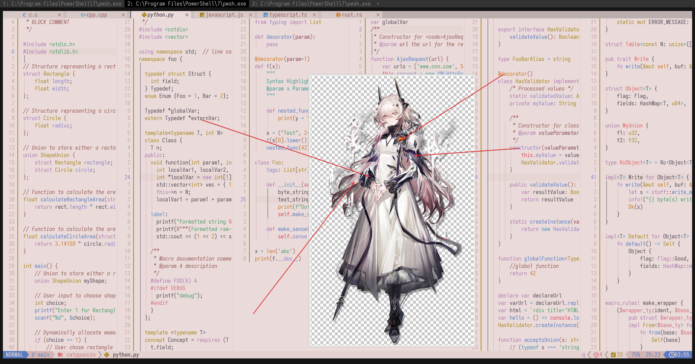

# Theresa

- **Character:** Theresa
- **Source:** Arknights
- **Alias:** `特蕾西娅` (CN), `魔王` (CN), `Theresa` (EN), `テレジア` (JP)
- **Reference:** [Donmai Wiki](<https://donmai.moe/wiki_pages/arknights_theresa>), [Moegirlpedia](<https://zh.moegirl.org.cn/zh-hans/%E7%89%B9%E8%95%BE%E8%A5%BF%E5%A8%85(%E6%98%8E%E6%97%A5%E6%96%B9%E8%88%9F)>)
- **Index:** `#6`

---

> `Theresa` is the 6th character in this project.
>
> The first version looked very similar to [Rosé Pine](https://rosepinetheme.com/), so I removed yellow and added red to make it feasible.
> The second version was not pink enough. Pink actually means darker, but I adjusted it as much as possible within the acceptable contrast range.
>
> Making this character is semantically related to the [previous character](../arknights_priestess/README.md), as the saying goes, "did it along the way".
>
> Interestingly, the contrast between Base and Subtext0 did not reach 4.5:1. After reviewing the character art again, I decided not to fix it.
>
> 2025-07-27 Pulled Pink and Rosewater apart.

## Palette

The complete color data is stored in the [JSON](./palette.json) file.

The JSON format suitable for Whiskers is stored in [palette-whiskers.json](./palette-whiskers.json).

### Matrix

The raw data for the contrast matrix analysis is in [JSON format](./contrast-matrix.json) (another version with [only base comparison](./contrast-base.json) is also provided), and a more readable [Markdown version](./contrast-report.md) is also available.

### Source

Look at the following image, it's self-explanatory.



## Porting

### Neovim

<details>
	<summary>As catppuccin's latte flavor</summary>

```lua
require("catppuccin").setup {
    color_overrides = {
        latte = {
        rosewater= "#cf6d7d",
        flamingo = "#dd6363",
        pink     = "#b74757",
        mauve    = "#af78af",
        red      = "#d7425b",
        maroon   = "#8a4254",
        peach    = "#ca7623",
        yellow   = "#a7851d",
        green    = "#4b9b66",
        teal     = "#419891",
        sky      = "#4692b8",
        sapphire = "#5d8fc1",
        blue     = "#597bc0",
        lavender = "#8d82c3",
        text     = "#534853",
        subtext0 = "#746474",
        subtext1 = "#635663",
        base     = "#EADBDA",
        mantle   = "#E4D2D0",
        crust    = "#DFC8C6",
        surface0 = "#D4B5B3",
        surface1 = "#C9A29F",
        surface2 = "#BE8F8C",
        overlay0 = "#B37C78",
        overlay1 = "#A86965",
        overlay2 = "#985A56",
        },
    }
}
```

</details>
