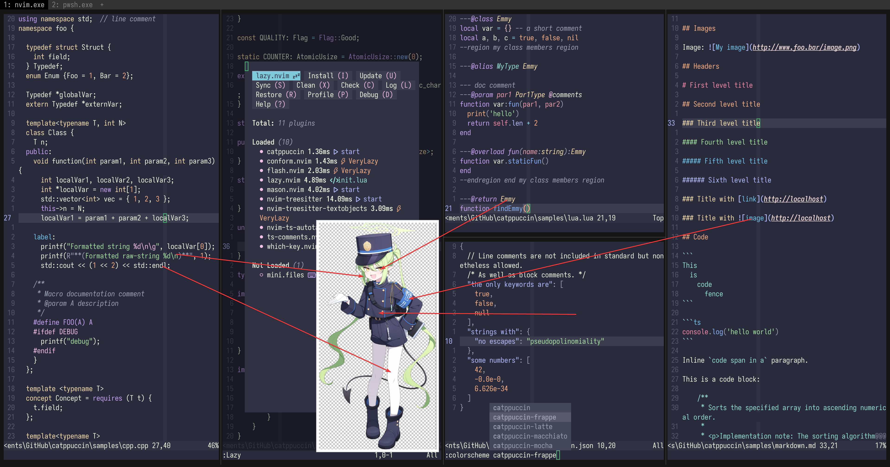

# nozomi

- **Character:** 橘ノゾミ (たちばなのぞみ)
- **Source:** ブルーアーカイブ (Blue Archive)
- **Alias:** `Tachibana Nozomi` (EN), `橘望`, `橘希望` (CN)
- **Reference:** [Donmai Wiki](<https://donmai.moe/wiki_pages/nozomi_(blue_archive)>), [Pixiv Encyclopedia](https://dic.pixiv.net/a/%E6%A9%98%E3%83%8E%E3%82%BE%E3%83%9F)
- **Index:** `#1`

---

> Her only specialty is that she was the first.
> Unlike the importance of Catppuccin to Neovim, nozomi was simply the first.
> Because of this, if she had not existed, another character would have been the first.

## Palette

The complete color data is stored in the [JSON](./palette.json) file.

The JSON format suitable for Whiskers is stored in [palette-whiskers.json](./palette-whiskers.json).

### Matrix

The raw data for the contrast matrix analysis is in [JSON format](./contrast-matrix.json) (another version with [only base comparison](./contrast-base.json) is also provided), and a more readable [Markdown version](./contrast-report.md) is also available.

### Source

Look at the following image, it's self-explanatory.



## Porting

### Neovim

<details>
  <summary>As catppuccin's frappe flavor</summary>

```lua
require("catppuccin").setup {
    color_overrides = {
        latte = {
        rosewater= "#F5E0DC",
        flamingo = "#F2CDCD",
        pink     = "#F5C2E7",
        mauve    = "#CBA6F7",
        red      = "#F38BA8",
        maroon   = "#EBA0AC",
        peach    = "#FAB387",
        yellow   = "#F9E2AF",
        green    = "#A6E3A1",
        teal     = "#94E2D5",
        sky      = "#89DCEB",
        sapphire = "#74C7EC",
        blue     = "#89B4FA",
        lavender = "#B4BEFE",
        text     = "#F4F9E3",
        subtext0 = "#CCD2BD",
        subtext1 = "#E0E6D0",
        base     = "#292A3C",
        mantle   = "#303143",
        crust    = "#38394C",
        surface0 = "#47495C",
        surface1 = "#58596D",
        surface2 = "#686A7F",
        overlay0 = "#7A7B91",
        overlay1 = "#8C8DA3",
        overlay2 = "#9EA0B6",
        },
    }
}
```

</details>
