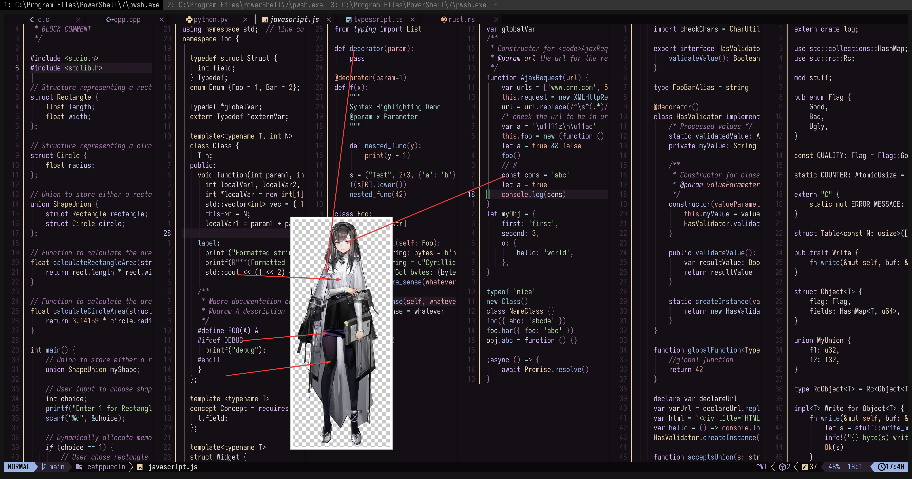

# Priestess

- **角色:** 普瑞赛斯
- **出处:** 《明日方舟》 (Arknights)
- **别名:** `Priestess` (EN), `プリースティス` (JP)
- **参考:** [Donmai Wiki](<https://donmai.moe/wiki_pages/priestess_(arknights)>), [萌娘百科](https://zh.moegirl.org.cn/zh-hans/%E6%99%AE%E7%91%9E%E8%B5%9B%E6%96%AF)
- **序号:** `#5`

---

> `普瑞赛斯` 是这个项目的第 5 个角色。
>
> 第一版和 [Helix](https://helix-editor.com/) 长得非常像，所以调低了亮度。
> 可惜的是，这并不妨碍它还是和调低亮度的 Helix 长得像。
>
> 做这个角色是为了测试一个紫色底的主题。从抄袭嫌疑上看，这似乎是较为失败的。

## 配色

完整的色彩数据存储在 [JSON](kal'tsit.json) 文件中。

### 矩阵

对比度矩阵分析的原始数据为 [JSON 格式](contrast.json)（另提供一份 [仅与 base 对比的版本](base-contrast.json)），同时也提供了一份更易于阅读的 [Markdown 版本](contrast.md)。

### 来源

查看以下图片，这是不言自明的。



## 移植

### Neovim

<details>
	<summary>作为 catppuccin 的 macchiato flavor</summary>

```lua
macchiato = {
-- Priestess

		rosewater = "#B58F8F",
		flamingo = "#C28483",
		pink = "#C180A9",
		mauve = "#AA84DA",
		red = "#D35B5B",
		maroon = "#B24444",
		peach = "#C38E66",
		yellow = "#9C9E2F",
		green = "#77A05E",
		teal = "#4AA99E",
		sky = "#5D9DB8",
		sapphire = "#359FBD",
		blue = "#4F83E3",
		lavender = "#8D91E5",

		text = "#4C4B50",
		subtext0 = "#6C6B6C",
		subtext1 = "#5C5B5E",

		base = "#F5F4E5",
		mantle = "#ECECDF",
		crust = "#E2E3D8",
		surface0 = "#D2D3CA",
		surface1 = "#C2C3BC",
		surface2 = "#B2B3AE",
		overlay0 = "#A2A3A0",
		overlay1 = "#929291",
		overlay2 = "#828283",
},
```

</details>
