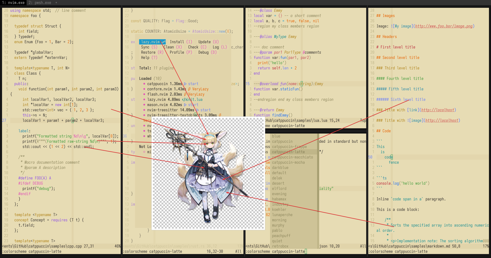

# suzuran

- **角色:** 铃兰
- **出处:** 《明日方舟》 (Arknights)
- **别名:** `丽萨`（本名）, `Suzuran`、`Lisa` (EN), `スズラン`、`リサ` (JP)
- **参考:** [Donmai Wiki](<https://donmai.moe/wiki_pages/suzuran_(arknights)>), [PRTS](https://prts.wiki/w/%E9%93%83%E5%85%B0)
- **序号:** `#2`

---

> 铃兰是这个项目的第 3 个角色。
>
> 这次尝试做一个 light theme，挑上铃兰（或所谓的“大家的光”）算是合适的。然而，可能是因为 o3 的模型更熟悉 dark theme 的用法，导致我多次尝试 prompt，都未能选出理想的语义化颜色。\
> 一开始我是喂了她的 4 个时装进去的，但是这直接导致 o3 的 python 环境崩溃，导致它一直重启它的环境，最后思考时间超过 12 分钟之后直接卡死，过程非常有趣。\
> 后来，我改为仅使用她的默认时装，这才基本成功。

## 配色

完整的色彩数据存储在 [JSON](suzuran.json) 文件中。

### 矩阵

对比度矩阵分析的原始数据为 [JSON 格式](contrast.json)（另提供一份 [仅与 base 对比的版本](base-contrast.json)），同时也提供了一份更易于阅读的 [Markdown 版本](contrast.md)。

### 来源

查看以下图片，这是不言自明的。



## 移植

### Neovim

<details>
  <summary>作为 catppuccin 的 latte flavor</summary>

```lua
latte = {
		-- suzuran

    rosewater = "#8F4E4C",
    flamingo = "#874542",
    pink = "#8E4561",
    mauve = "#6B4A7F",
    red = "#b43842",
    maroon = "#a34246",
    peach = "#8F5524",
    yellow = "#6E5715",
    green = "#0C6B51",
    teal = "#18685A",
    sky = "#255B74",
    sapphire = "#066ca2",
    blue = "#386a8f",
    lavender = "#715894",

    text = "#111115",
    subtext0 = "#2b2e34",
    subtext1 = "#1e1f24",

    base = "#E7DCB4",
    mantle = "#DED2A6",
    crust = "#D6C897",
    surface0 = "#C5B57B",
    surface1 = "#B5A25E",
    surface2 = "#A48F3F",
    overlay0 = "#947C16",
    overlay1 = "#806B12",
    overlay2 = "#6C5A0D",
},
```
