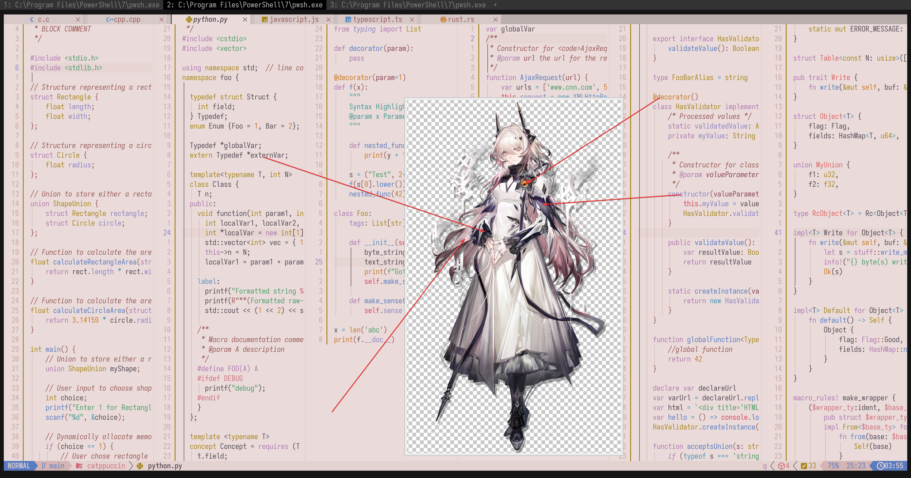

# Priestess

- **角色:** 特蕾西娅
- **出处:** 《明日方舟》 (Arknights)
- **别名:** `魔王` (CN), `Theresa` (EN), `テレジア` (JP)
- **参考:** [Donmai Wiki](<https://donmai.moe/wiki_pages/theresa_(arknights)>), [萌娘百科](<https://zh.moegirl.org.cn/zh-hans/%E7%89%B9%E8%95%BE%E8%A5%BF%E5%A8%85(%E6%98%8E%E6%97%A5%E6%96%B9%E8%88%9F)>)
- **序号:** `#6`

---

> `特蕾西娅` 是这个项目的第 6 个角色。
>
> 第一版和 [Rosé Pine](https://rosepinetheme.com/) 长得非常像，去黄加红了才算可行。\
> 第二版又不够粉。粉其实是变深的意思，但是还是尽可能在对比度能接受的范围调整了。
> 
> 做这个角色在语义上是和 [上一个角色](../priestess_(arknights)/README.md) 有联系的，俗话说就是“顺便做了”。
>
> 有趣的是，Base 和 Subtext0 的对比度并没有达到 4.5:1。再次查看立绘，我决定不予修复。

## 配色

完整的色彩数据存储在 [JSON](kal'tsit.json) 文件中。

### 矩阵

对比度矩阵分析的原始数据为 [JSON 格式](contrast.json)（另提供一份 [仅与 base 对比的版本](base-contrast.json)），同时也提供了一份更易于阅读的 [Markdown 版本](contrast.md)。

### 来源

查看以下图片，这是不言自明的。



## 移植

### Neovim

<details>
	<summary>作为 catppuccin 的 latte flavor</summary>

```lua
latte = {
-- priestess

    rosewater = "#cf6d7d",
    flamingo = "#dd6363",
    pink = "#ce6e7b",
    mauve = "#af78af",
    red = "#d7425b",
    maroon = "#8a4254",
    peach = "#ca7623",
    yellow = "#a7851d",
    green = "#4b9b66",
    teal = "#419891",
    sky = "#4692b8",
    sapphire = "#5d8fc1",
    blue = "#597bc0",
    lavender = "#8d82c3",

    text = "#534853",
    subtext0 = "#746474",
    subtext1 = "#635663",

    base = "#EADBDA",
    mantle = "#E4D2D0",
    crust = "#DFC8C6",
    surface0 = "#D4B5B3",
    surface1 = "#C9A29F",
    surface2 = "#BE8F8C",
    overlay0 = "#B37C78",
    overlay1 = "#A86965",
    overlay2 = "#985A56",
},
```

</details>
